# Final projects

  

tl;dr: the easiest project:

  - If you don't want to think hard and want to do something useful
    for future iterations: simply boot up a new microcontroller, port
    the bootloader and a few labs, and write it up.  This has large bang
    for buck.

Project logistics:
 - Should be about 3 labs worth of work.  More is also ok!
 - You can work with teams of up to 3 but more team members = more
   work required for same grade.
 - We can reimburse for equipment (within reason).
 - The final project presentations will be during the 140e final slot.
 - The presentation is optional.  There are 5 minute and 10 minute
   slots depending on the project size.

What to turn in:
 - You should write up a short description of your project (1 page is
   fine).  What the idea is, what the challenges were, what devices you
   did, any errata.
 - Ideally you make a video showing your project and have this on
   your github with a title + desciption so so we can point people in
   future classes to it.

   I think going over final projects on the first intro day of class is
   probably better than jumping into machine code (as we did this year).

Write up your devices as labs!

  - It counts towards the overall project if for any device you have
    you write up a short device lab on how to get it working (and how
    to check its results) with the datasheet and maybe some starter code.

    Importantly: if another group successfully runs your lab and
    implements the device and gives feedback, this counts towards both
    groups final project grade.

  - If the lab is reasonable, we'll add it to the official repo with
    your name etc.  Ideally over the years we can build up 10s (100s?) of
    new device labs spun out from different final projects.

You can (and are encouraged to) devise your own final project, but we've
listed out some possible options below.  The first set is from the web
(most are pretty ambitious so you'd likely cut them down) followed by
some more OS centric projects.

------------------------------------------------------------------------------
## Final projects ideas from the web.

Some final project ideas:

 - Leak data using EM.  

 - [led earring](https://twitter.com/cnlohr/status/1760205375989760182?t=rpdSMSyzZ7YBwPwGIN8aVw&s=19).  Interesting project --- you'd need to boot up a small microcontroller and figure out packaging and battery.

 - I haven't tried this so buyer beware but:
   XMR has a weird asic resistant mining method (you run weird little
   programs that touch a lot of memory).   It would be interesting if
   you could implement on the pi and maybe do vm hacks to speed up and/or
   use parthivs cluster board.

   No idea if feasible but looks interesting.

 - High-speed secondary memory interface (from akshay):

   The Pi has what's called a "secondary memory interface", which allows
   high-speed parallel communication between two Pis or a Pi and an
   external device.  This isn't documented in the Broadcom datasheet,
   except for some cryptic references in the alt mode table, but there
   are a couple of blog posts using it:

     - https://iosoft.blog/2020/07/16/raspberry-pi-smi/
     - https://iosoft.blog/2020/09/29/raspberry-pi-multi-channel-ws2812/

   Getting this working baremetal and making a really high-speed link
   between two Pis (or talking to something with a parallel interface,
   like a camera or LCD) would be a cool final project!

  - (From Joe): We have 1 spare [pinetime](https://wiki.pine64.org/wiki/PineTime, https://pine64.com/product/pinetime-dev-kit/) and I'm sure can get more if people are interested and shipping permits

    The pinetime is an open source smartwatch with a touchscreen,
    heartrate monitor, vibration motor, button, accelerometer,  and
    bluetooth.

    It might be cool to wear a watch that you wrote every line of code
    for. Also has interesting problems like how to conserve battery
    while keeping it usable, etc.

  - [Booting on a cheap microcontroller](https://hackaday.com/2023/02/16/puya-py32-the-cheapest-flash-microcontroller-you-can-buy-is-actually-an-arm-cortex-m0/)
  - Dunno if feasible but seems cool: 
    [Date recordings using eletrical noise](https://twitter.com/isaach/status/1628869010329837575?t=GAaYWN-bVkQfgIzBXDAd-Q&s=19)

  - [EKG input](https://twitter.com/ingarobotics/status/1635486902068584448?t=XhXbmr6DiyfUDR1IwZVU0Q&s=19)

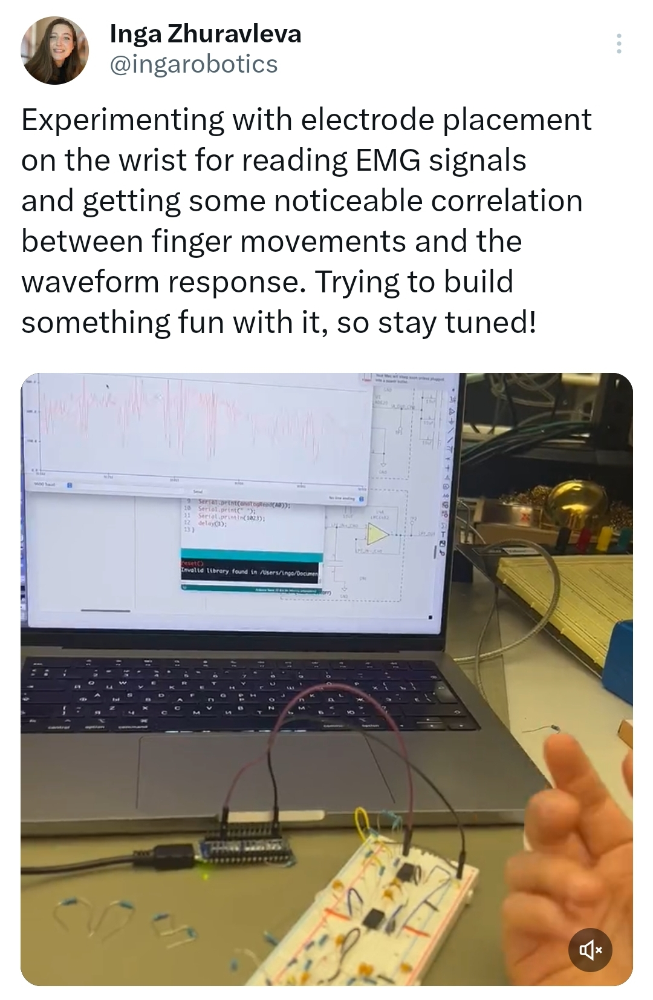

  - [Water clock](https://twitter.com/Rainmaker1973/status/1638255091726577664?t=_bQHFrQQ8swiuk2H27Ik8g&s=19)

  - make a pi cluster like (https://twitter.com/ExtElec/status/1641839012976422916?t=BIczeyLC6jGq1SPQY2ovRw&s=19).  Parthiv made cluster boards.

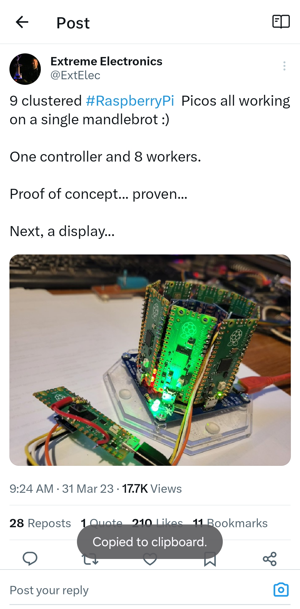

  - [pi watch](https://www.raspberrypi.com/news/how-to-build-your-own-raspberry-pi-watch/)

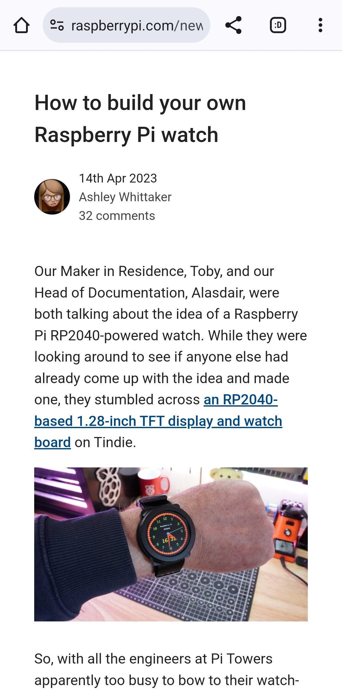

  - [nixie light controller](https://www.hackster.io/news/charles-lohr-turns-a-0-10-risc-v-microcontroller-into-a-software-defined-flyback-for-nixie-tubes-aabafa76aa78)

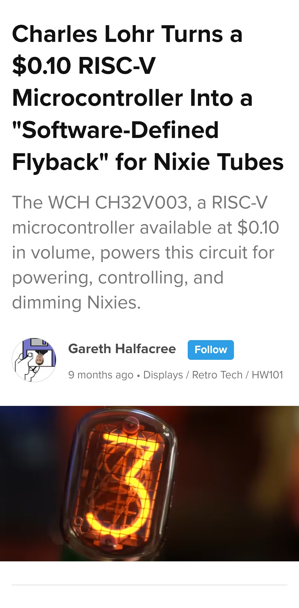

  - [ethernet](https://vanhunteradams.com/Pico/Ethernet/UPD_TX.html)

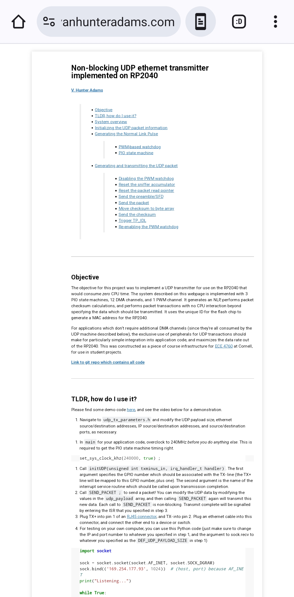

  - [Leaking bits using PMU](https://www.zdnet.com/article/academics-turn-pc-power-unit-into-a-speaker-to-leak-secrets-from-air-gapped-systems/)

  - [realtime magnetic imaging](https://twitter.com/giammaiot2/status/1658066614225436672?t=6f5wfOGh8VAopwXZLIIL0g&s=19)

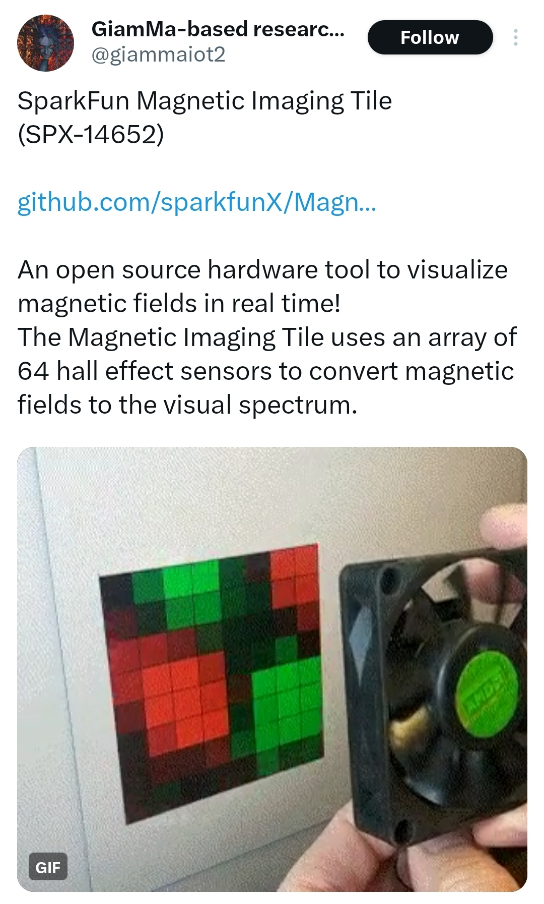

  - [self balancing platform](https://twitter.com/Rainmaker1973/status/1658045259287343106?t=bqFBhwwcl_iN5KdP_BN1sA&s=19)

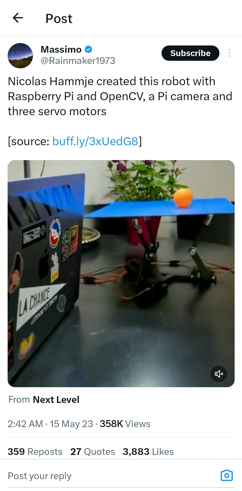

  - Use multiple cheap displays to make a [solid state volumetric display](https://twitter.com/idlehandsdev/status/1661343789527490560?t=Nu2ctoQwNTfaGB15K8XY_A&s=19).  
     

  - [networked subwoofer](https://www.audiokinesis.com/the-swarm-subwoofer-system-1.html)

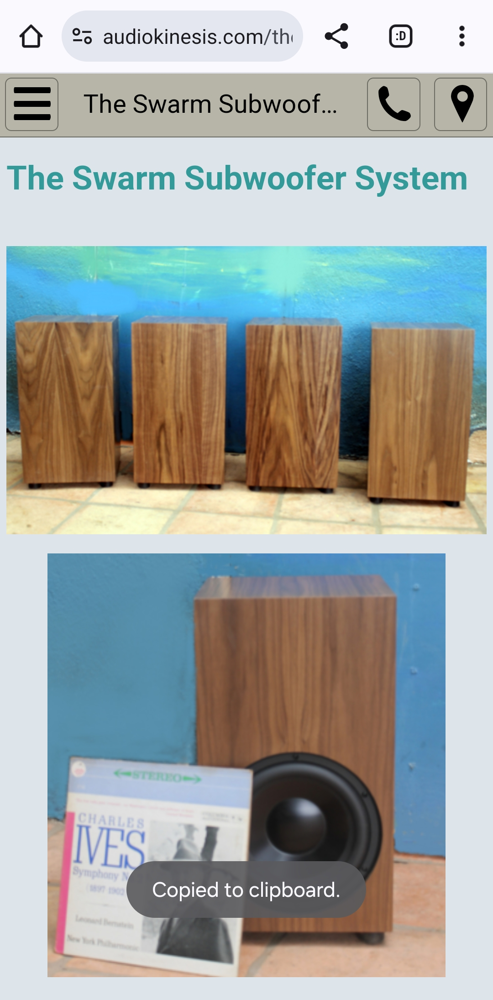

  - [cute signal jammer](https://twitter.com/giammaiot2/status/1662541683404206080?t=k-eKGufcn9Yc_oGn5CCbUw&s=19)

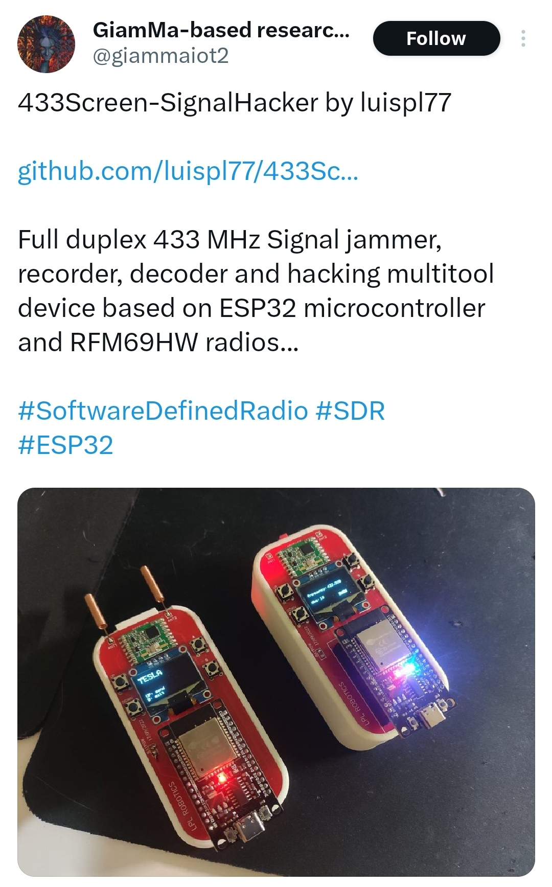

  - [RF or wifi scanner](https://twitter.com/lozaning/status/1663575202461110273?t=7YQENE0C9Qn2iungYQ53CQ&s=19)

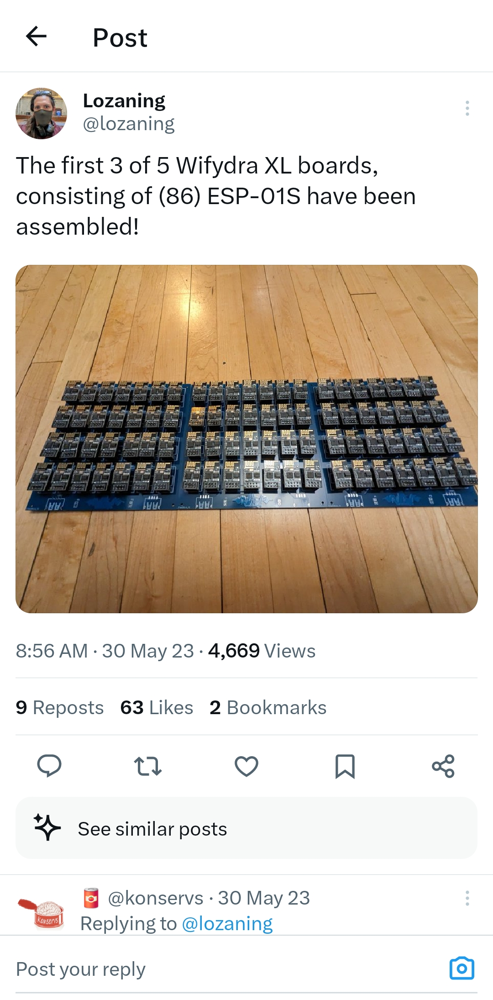

  - [Art display](https://twitter.com/cryptograffiti/status/1663237774500036625?t=W4NET2jMKwsw3LcKz5bDzA&s=19)

  - [clean little oscilliscope](https://hackaday.com/2023/02/27/diy-stm32-scope-is-simple-cheap-and-featureful/)

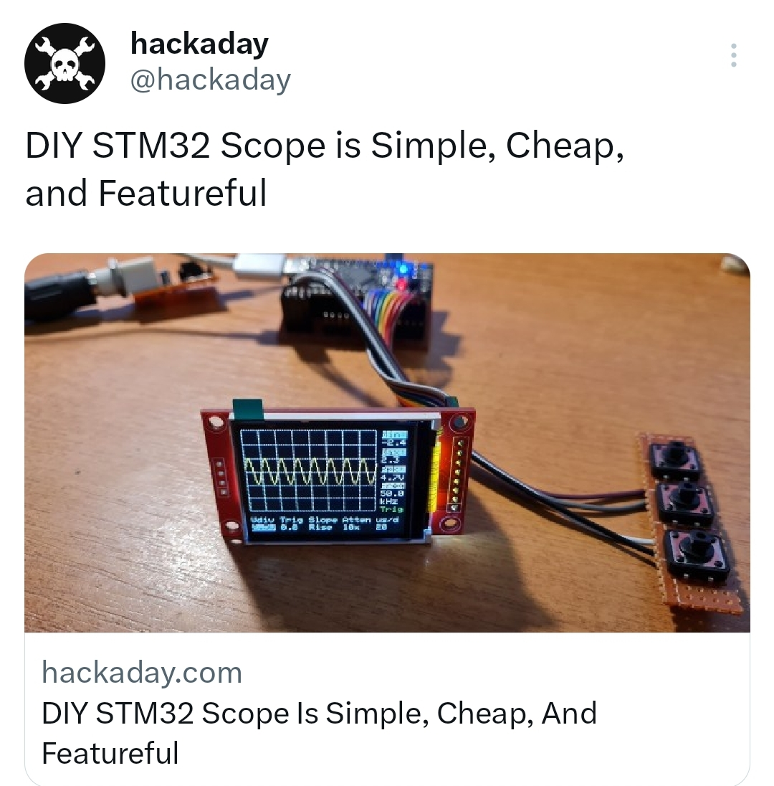

  - [pi raid](https://www.geeky-gadgets.com/raspberry-pi-nas-60-hhds-23-06-2022/)

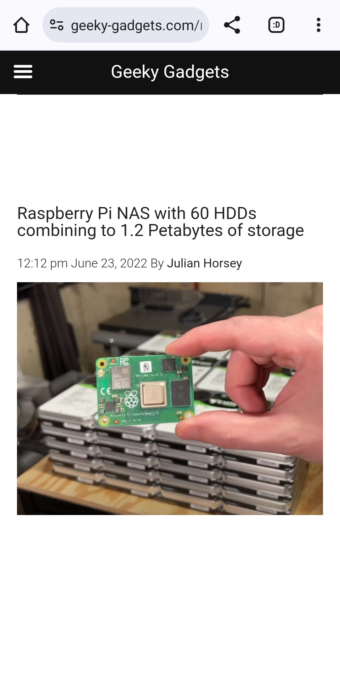

  - [wireless mouse](https://www.hackster.io/news/wireless-mouse-ring-interface-d34ef0beb831)

  - OS on ipod mini: [some starter code](https://github.com/dwelch67/ipod_mini)

  - [Make a tiny bootloader](https://twitter.com/cnlohr/status/1635082283798659072?t=uw8rDkMPdz1VJdoLMNzjJA&s=19)

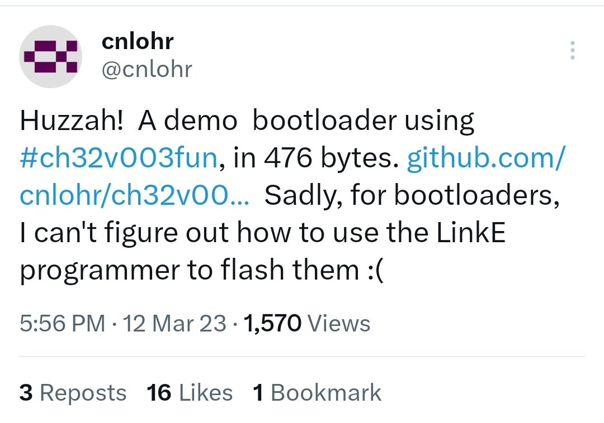

  - Fun music: tactile mini.

    https://twitter.com/diyelectromusic/status/1632505624222224384?t=kbn3nrGA_E6khPO6IEUlPw&s=19
    https://twitter.com/diyelectromusic/status/1634928271673667584?t=oR7l8HI1uOoBXodx11zYPw&s=19

  - [radiation detector](https://hackaday.io/project/27508-open-radiation-detector)

  - No idea if feasible, but doing 
    [night vision goggles seems fun](https://diyodemag.com/projects/build_your_own_raspberry_pi_powered_diy_night_vision_goggles_nvg)

  - Haven't looked at carefully but seems feasible  to 
    [use the pi to attack wireless devices](https://www.scip.ch/en/?labs.20230223)

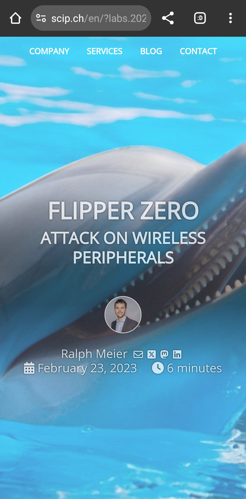

  - [booting a riscv laptop](https://linuxgizmos.com/licheeconsole4a-compact-laptop-with-risc-v-can-now-be-preordered/).  $300 rv laptop looks fine for custom os.

  - [Make a HAM radio](https://www.tomshardware.com/raspberry-pi/raspberry-pi-projects/raspberry-pi-pico-ham-transmitter-uses-onboard-pio-for-oscillator)

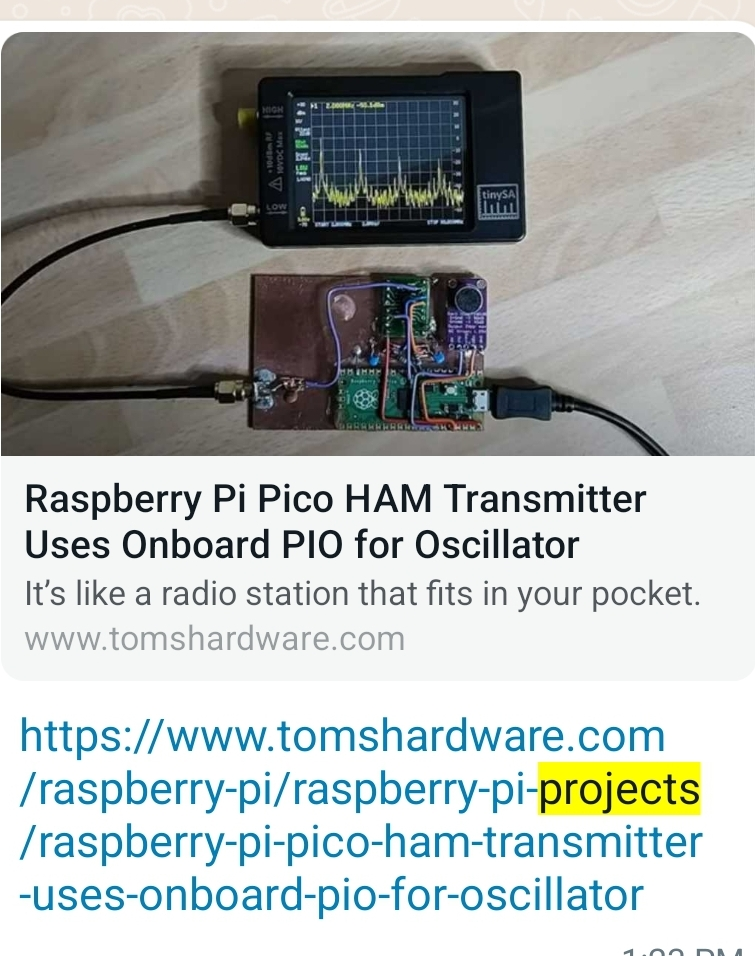

  - [Nice radio form factor](https://twitter.com/PicoAPRS/status/1729167493648785831?t=hZaXcFnTjq-gPLXC6NiaQw&s=19)

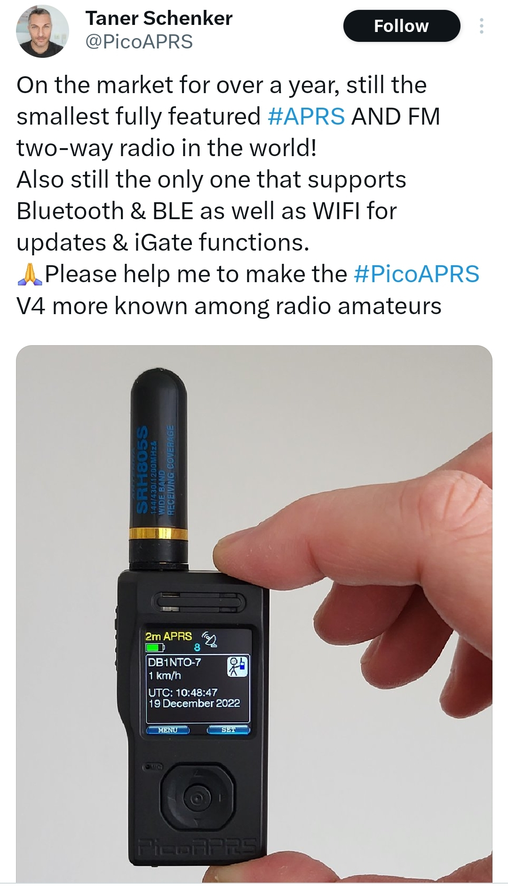

  - I haven't read closely but looks do-able:
    [Using the pi to snoop unencrypted bus traffic](https://www.tomshardware.com/pc-components/cpus/youtuber-breaks-bitlocker-encryption-in-less-than-43-seconds-with-sub-dollar10-raspberry-pi-pico).

  - Doing fault injection by messing with volates:
    https://www.synacktiv.com/how-to-voltage-fault-injection

    Basic puzzle: how to vary voltage to make the CPU jump over or do the
    wrong branch of an if statement?  Used to attack smart cards etc.

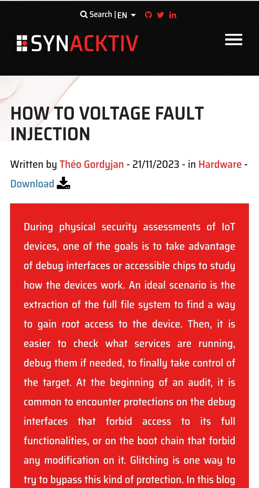

  - [Thermal imaging camera](https://twitter.com/mikerankin/status/1766084442563469477?t=vowWK8Xwmw48S2F7pKwB-A&s=03)

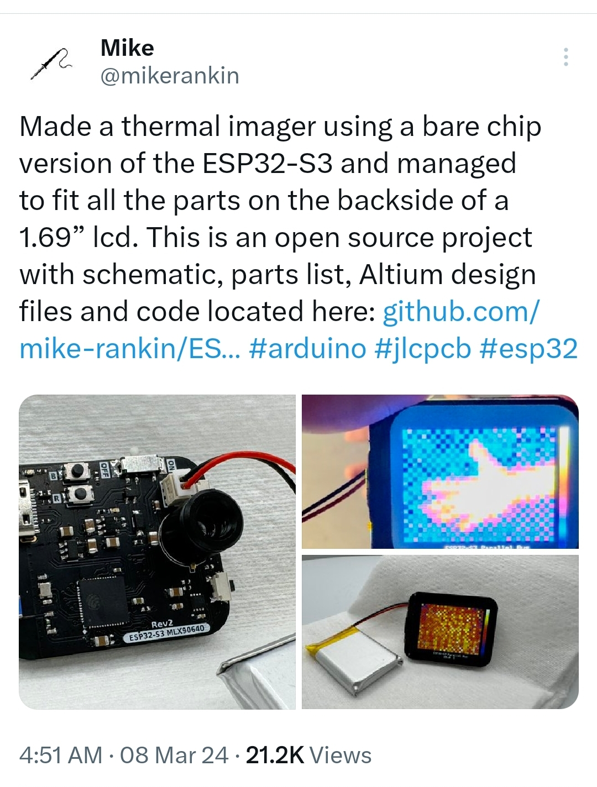

  - [Nice audio effects project](https://twitter.com/PaulStoffregen/status/1764384758442967393?t=JyjLgRwrqoCE5DFeolZ1pw&s=03)

  

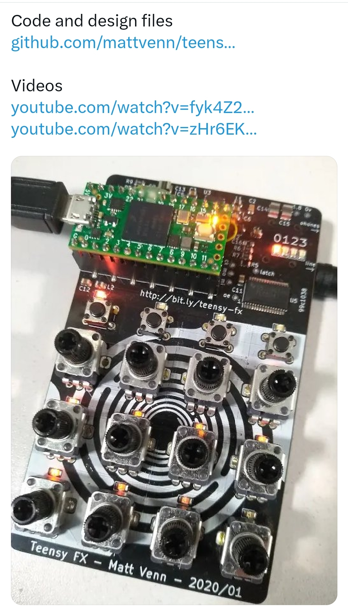

  - [Nice use of steppers for sound](https://twitter.com/getwired/status/1738832034133659792?t=Ino-fwkv6LJMJv6qmsweOA&s=03)

    There are labs for both (1) an i2s microphone and (2) using steppers 
    to make sound in last years 240lx.  

------------------------------------------------------------------------------
## Final projects ideas from us

### Do more OS

We've done a bunch of hello-world level hacks: you could build them into
something more full-featured:

- Add networking to the pi. One option is to hook it up to the
  [esp8266](https://www.sparkfun.com/products/13678) via the uart and
  communicate that way. Another is to use xbee's. There's also the newer
  ESP32 Wi-Fi+Bluetooth chip, and a few bluetooth modules you might be able
  to hook up---[Sparkfun](https://www.sparkfun.com/) and
  [Adafruit](https://www.adafruit.com/) are good places to look.

- Develop the virtual memory system into one that is full featured, able
  to handle the different page sizes, the different protection bits, etc.
  Have it correctly catch when code references beyond the end of the heap,
  dereferences null, and needs to dynamically grow the stack.

- Do a simple read-write `FAT32` file system so sensors can write data to the
  sd card and keep it around; make this available using FUSE so your laptop
  can access. Cooler: use the wireless above to export the SD's FAT32
  file system to your computer remotely using FUSE. - Alternatively, build support for a fancier filesystem (e.g.  
   [Ext2](https://en.wikipedia.org/wiki/Ext2)) into your OS, and
  integrate some of its interesting features (like UNIX permissions). - Or build a way to mount network/distributed file systems, so you can
  quickly update the "disk" of your Pi (or of multiple Pis) remotely.

- We use the `r/pi A`+, put there are many little boards out there.
  An interesting project is porting a bunch of the different code
  we've built to another system.

  I have the following boards available:

  - [Teensy 2.8, 3.2](https://www.sparkfun.com/products/13736): fast, small
  - [pocketbeagle](https://beagleboard.org/pocket): smaller than the pi!
  - various [esp8266 boards](https://www.sparkfun.com/products/13678):
    a low-cost, wifi capable system.

- Assemble all the different pieces you've built into a complete,
  small, embedded OS. I'd suggest domains, threads, some support
  for deadlines, and channels (pipes) to communicate.

- Extend your FUSE file system into a full-fledged way to interact
  with the pi. Have a method to mount devices into the file system,
  push results to the device and back, and in general have a way to
  share traffic over the UART. You will also certainly have to add
  interrupts to handle the UART (recall it has an 8-byte queue for
  transmit and receive, so can easily drop bytes) as well as having a
  more efficient approach to sending communication back/forth between
  your laptop and pi.

- Make a clean system that can sensibly blend pre-emptive, cooperative,
  and deadline-based run-to-completion threads (which do not need
  context switching)

- Rewrite the interrupt / exception handling to be much more efficient
  and extensible. Rip the code down to the bare minimum, enable icache,
  dcache, BTB, any other tuning you can. See how much faster you can
  make it compared to where we started.

  Take micro-benchmarks from the literature and see how much you can
  beat them by (how fast you can ping-pong bytes between threads,
  take a protection fault, etc). If you beat linux/macos by 50x I
  wouldn't be surprised.

- Explore a different OS design. There are several
  [models](https://wiki.osdev.org/Kernels) of kernel/OS design, each of which
  has its own pros and cons; we've focused on a UNIX-y kernel so far in this
  class, but the other approaches are also equally valid.

- Port real software to your OS. We have the framework for basic UNIX system
  calls (open, close, read, write, fork, exec). If you port a small C Library
  like [Newlib](https://wiki.osdev.org/Porting_Newlib), you can compile
  standard portable UNIX software (cat, echo, sh) to your OS. See what the
  most advanced program you can port is---a text editor? an assembler? a
  compiler? Can you compile your OS from within your OS?

- Port our OS to a different programming language, and show us why that
  programming language is better than C for OS development. A popular
  new-ish language for this is [Rust](https://www.rust-lang.org/), but there
  are other ones like C++ (very similar to C), [D](https://dlang.org/), and
  [Zig](https://ziglang.org/). Non-systems languages (Go, Lisp, Java, etc.)
  need a lot more runtime support, but might be possible if you put in some
  work.

- All major OSes support dynamically linked libraries, where a
  `.so/.dylib/.dll` file containing your library functions is linked with a
  binary right before runtime. Build a [dynamic
  linker](https://wiki.osdev.org/Dynamic_Linker) for your OS. You'll need to
  use a more advanced binary format like ELF which supports dynamic linking,
  and you'll need to figure out how to compile a dynamic library.

- Inter-process communication is crucial to any OS, but it's often slow.  
  Pipes (in their simplest form) involve copying data byte-by-byte multiple
  times to get it from one process's address space to the kernel and into
  another process's address space. Find a better model of IPC and add it to
  your kernel. One of the fastest things you can do is sharing memory
  between processes, but you need to be careful not to open security holes
  this way.

### Interface with Devices

One thing we didn't do very much of this year, but which real OSes have to deal
with all the time, is talking to 3rd party devices. Your laptop has to talk to
a screen, a keyboard, a mouse/trackpad, a Wi-Fi card, a Bluetooth chip, a USB
controller, a webcam, a microphone, speakers, and a whole host of other things
just to perform its basic functions. There are a few different ideas here, but
you can mix/match or come up with your own!

- Graphics: the Raspberry Pi has a powerful but arcane GPU built in, the
  [VideoCore IV](https://docs.broadcom.com/doc/12358545). Build a driver and
  appropriate system calls (or virtual files like `/dev/fb0` or however else
  you want to do it) to let applications on your OS control the screen, and
  figure out how they can share the screen effectively.

- Speed: the "primary" processor on the Pi is a vector processing unit, the
  [VideoCore IV VPU](https://github.com/hermanhermitage/videocoreiv). The
  VPU can do a superset of what the ARM can, but its documentation is a lot
  harder to find. Figure out some way to do a normally-slow calculation in
  parallel on the VPUs, and build an interface for your programs to offload
  computation to them.

- Device Drivers: There's a lot of cool and simple devices you can quickly
  write drivers for: LED strips (the ones based on the WS2812b controller,
  commonly called "Neopixels", are a good choice); servo motors (you'll need
  a separate motor controller); sonar and microwave-based distance sensors;
  accelerometers/gryoscopes/thermometers; infrared transmitters and
  receivers; character LCDs; graphical LCDs; etc. Pick a few of these
  devices, build drivers for them and any protocols they require. The Pi has
  hardware for i2c, spi, and i2s natively among others, but as you know you
  can build software versions of protocols as well. Combine the devices into
  an interesting cohesive project, or build user-level support for them into
  your OS.

- Audio: the Pi A+ has a headphone jack built in, connected to GPIO pins 40
  (right channel) and 45 (left channel). - Using either GPIO or
  [PWM](https://en.wikipedia.org/wiki/Pulse-width_modulation), build
  some sort of music player. Try to get multiple channels and audio
  mixing working, so you can play interesting music. - You could get a [VS1053 audio
  codec](https://www.adafruit.com/product/1381) and play (and record!)
  much higher-quality audio. Commercial applications like Zoom have
  about 300 ms of end-to-end audio latency; can you do better with 2
  Pis and a custom network protocol? - An audio driver is an interesting challenge in a multitasking system;
  you need to send data to the audio chip continuously, but you can't
  let your audio-playing application hog up the CPU forever. You also
  can't buffer your audio too much in your kernel, or you'll end up
  with ridiculous amounts of lag that make real-time audio impossible.  
   Upgrade your threading system to make real-time audio possible, while
  still giving applications their fair share of time on the CPU. - MIDI, a standard communication protocol for digital instruments, is
  based on serial; your Pi can already speak it. Turn your Pi into a
  musical instrument, or plug it into a MIDI controller as a unique
  input device.

- Integration: You already have the fundamental knowledge to build drivers
  for basically anything you want. Want to switch a light on and off? Read
  your Stanford ID card using NFC? Take pictures? Print on that thermal
  paper they use for receipts? Use LIDAR to map your room? All you need is
  a piece of hardware, a datasheet, and time. Talk to us if you have ideas
  of devices you want to interact with; we can help you look for hardware
  that'll work with the Pi.

### Build a Tool

- Volatile cross-checking. A very common, nasty problem in embedded
  is that the code uses pointers to manipulate device memory, but
  either the programmer does not use `volatile` correctly or the
  compiler has a bug. We can detect such things with a simple hack:

  - We know that device references should remain the same no matter
    how the code is compiled.
  - So compile a piece of code multiple ways: with no optimization, `-O`,
    `-O2`, with fancier flags, etc.
  - Then run each different version, using ARM domain tricks to trace
    all address / values that are read and written.
  - Compare these: any difference signals a bug.

  This is basically your second lab, with some high-end tricks.
  It would have caught many errors we made when designing cs107e;
  some of them took days to track down.

- Build a debugger that can run over the UART. Insert breakpoints to
  stop execution. Use the special ARM hardware to do data watch-points.
  Figure out how to do a backtrace and to match up instruction program
  counter values to the C code (not hard if you use the `.list` files).  
  You'll likely have to add interrupts to the UART.

  - GDB has a protocol that lets you debug a device over a serial
    connection. It's a lot more work than rolling your own debugger, but it
    gives you the full power of GDB to inspect your kernel and your
    user-level programs.
  - UNIX supports a system call called `ptrace` which lets one process
    inspect and control another one, which is what GDB uses to set
    breakpoints and single-step. You have most of the infrastructure for
    this already; find a clever way to expose it to your user-level programs
    (ideally without compromising security), and run your debugger at the
    user level instead of in the kernel.

- Do a trap-based valgrind/purify so you can detect memory corruption.
  Valgrind checks every load and store to see if you are writing outside
  of an object's boundary. It does so by dynamically rewriting the
  executable code. This is hard. Instead you can use your virtual
  memory system to:

  - Mark all heap memory as unavailable.
  - In the trap handler, determine if the faulting address is in bounds.
  - If so: do the load or store and return.
  - If not: give an error.

  Given how fast our traps are, and how slow valgrind is, your approach
  might actually be faster.

- Do a trap-based race detector: similar to valgrind above, Eraser
  is a well known (but dead) tool for finding race conditions that worked
  by instrumenting every load and store and flagging if a thread accessed the
  memory with inconsistent set of locks. As above, b/c binary rewriting is
  hard you can use memory traps to catch each load/store and check if
  the locks the current thread holds are consistent.

- Do a statistical version of either the race detector or memory
  checker above: set your timing interrupts to be very frequent and
  in the handler, do the check above. It may miss errors, but will be
  very fast and should do a reasonable job, given a long enough run and
  a fine-enough window.

- Write cooperative thread checkers that detect when you run too long
  with interrupts disabled, too long without yielding, in a deadlock,
  spinning on a condition that cannot change, extend past the end of
  the stack, have priority inversion, starvation, missed deadlines,
  lock queues that are too long, or critical sections that are too long.

- Extend your bootloader checker to check other network / distributed
  systems protocols. (This is likely only feasible if you've taken a
  distributed system or networking class.) These protocols do not get
  exhaustively tested for every possible failure, so often have subtle flaws.
  You're in a good position to find some. There's a lab we skipped over for
  time reasons this year which may be a good starting point:
  [replay](https://github.com/dddrrreee/cs140e-20win/tree/master/labs/5-replay).

- ARM code is not that hard to parse (at least compared to x86). We can
  use this ability to make a effective, but hopefully simple lock-free
  algorithm checker. Given a set of functions that purport to run
  correctly (either with or without locks) we can:

  - disassemble them.
  - at each load or store, insert a call to a context switch.
  - run the code with two threads.
  - first test that they give the same result as two sequential calls
    if we do a single context switch at each possible point, then two
    context switches, etc.

  To be really fancy, we can buffer up the stores that are done and then
  try all possible legal orders of them when the other thread does a load.
  This checker should find a lot of bugs.
  
 - Use JTAG to implement interesting checkers: Via JTAG, a remote 
  device can halt the execution of instructions, read machine state, 
  single-step through code, set breakpoints and set watchpoints on a the 
  target device. This is in contrast to the native debugging performed 
  by a device on its own code. You can use this to debug and check code
  on a remote pi: you can single step through super level instructions 
  as well (native single-stepping is only possible for code running in
  user mode). The JTAG protocol is specified in the 
  ARM1176 document (chapter 14).
  

#### Protection Systems (using CPU Domains)

As discussed in lab, you can use ARM domains to very quickly switch the
permissions for a set of pages. It'd be interesting to use this
ability for various things. One possibility: use it to make embedded
development less dangerous.

##### Protected subsystems.

As you probably noticed, we have no protection against memory corruption.
As your system gets bigger, it becomes much much harder to track down which
subsystem is causing everything to crash. Going all the way to
UNIX style processes is one attack on this problem, but we can use
ARM do to a lighter weight method:

- give each domain a unique domain number.
- tag all memory associated with the domain with its domain number.
  (you may have to have additional domain numbers for pages accessible
  by more than one).
- before you call into the domain, change the domain register so that
  domain has client privileges, but no other domain is accessible.
- at this point it can only touch its own memory.

This method is much faster than switching between processes: we don't
have to flush the TLB, caches, or page table.

###### Lightweight protection domains

As a lighter-weight intermediate hack: if we want to proect one thread
from another, we usually throw it in a different address space. This can
be a lot of overhead. Instad, tag its memory with a seperate domain ID
and do what we do above.

###### Subpage-protection

If we have some code that is causing corruption but we can't fiure out,
use domains to quickly turn off/on write-permissions for all memory
(or for unrelated memory) and monitor the traps that occur to see if
the code is accessing outside of its region.

### Various Other Things

- Tests! This might sound like a low-IQ kind of project, but thinking
  carefully about the assumptions of various pieces of code (e.g., vm) and
  detecting how they are broken requires both understanding and cleverness
  and is a great way to get a deep understanding how things work.

  This project would involve writing an aggressive set of tests that
  could blow up as much of our code as possible. You could also develop
  a more rigorous set of tracing methods to get a more incisive view
  of what code does (rather than just checking its output at the end).

  These would get bundled into next year for sure.

- A real bare-metal wireless driver. This is likely a pretty hard project,
  but there's lots of people in the wild that would love it.

- Similarly, taking the SD card driver (or another) and aggressively tuning
  it should make orders of magnitude difference in bandwidth/speed. This is
  probably easier than wirelesss by 10x at least. It's also very useful for
  other people out there. (E.g., search "raspberry pi bare metal sd driver").

--------------------------------------------------------------------

  

