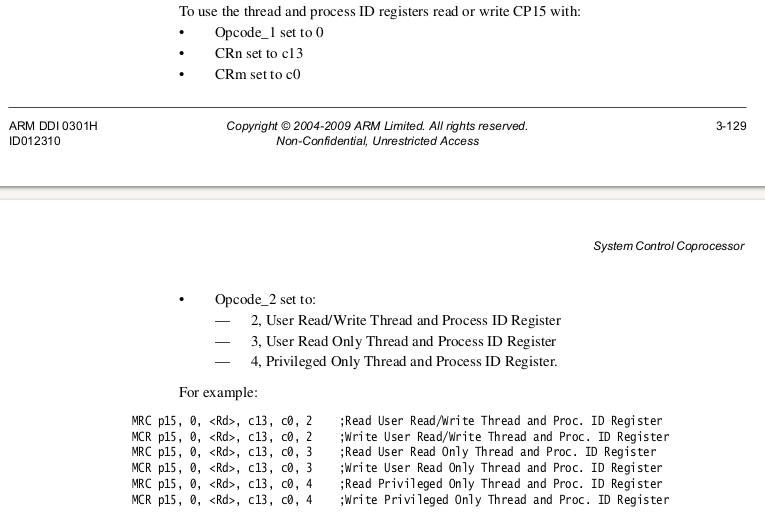

## Lab: building your own logic analyzer

***NOTE: the [PRELAB.md](PRELAB.md) has a bunch of links to instruction
   set documents.***

This lab you will use your second pi to build a logic analyzer that
records when the output from a pi  or sensor transitions from 1-to-0
or 0-to-1.

Making a simple analyzer is simple --- less than 20 lines --- but then
we will spend a fair amount of time making it as accurate as possible.
Accuracy will require looking at the machine code `gcc` generates from
your C code, diagnosing what is messing up your accuracy, understanding
why `gcc` is doing what it is doing, and devising ways to work around it.
(Or, alternatively, simply writing code in assembly.)

If you do things right, you'll be able to reliably measure transitions
down to the 10ns of nanoseconds.  The result of this process will be
developing a not-novice understanding of the underlying ARM hardware and
of the gcc compiler.  This understanding will serve you well elsewhere,
even on non-ARM machines (in the same way that understanding one
programming language helps you understand others).

This is one of those interesting cases where, because we write code
bare-metal and don't have to fight a large operating system, we can
easily do something that is well beyond the abilities of a system such
as Linux or MacOS: there is no way you can make these systems reliably
take these kind of timings.

Interestingly, it appears with a bit of code and a $20 pi, we can also
easily beat specialized hardware logic analyzers.  For example --- as far
as I can tell as a novice user --- the widely-used $400 Saleae analyzer
has orders of magnitude less resolution.  Also, their claim to fame is
that they can measure multiple inputs (around 16 I believe) and have used
custom FPGA logic to do so.  However, we can get the same effect, with
no work, because reading up to 32 pi pins can be done with a single load.

### Why are we making an analyzer?

As we start using different sensors, you'll have numerous cases where
you've misunderstood a sensor datasheet or you've understood the
datasheet just fine but it was incorrect or the senor was counterfeit
(and didn't adhere exactly to the sensor contract) or was just broken
(all of these happen more than you think!).   The most common result
of these errors is that the sensor quietly does nothing, which isn't a
particularly informative clue as to the distal, root cause of the error.

Your logic analyzer will help you find a path forward in these cases,
by giving you visibility into what signals were sent (and when) from
the pi to the sensor and vice versa.  Without too much distortion,
you can think of your analyzer as a way to add `printk` to electricity.
Example errors it can diagnose:

   - On the pi side: where you send bits out backwards (an easy mistake),
     at the wrong times (same), or with the wrong values (even more same).
     Or when the compiler has removed or reordered stores to device
     memory (e.g., if you make mistakes with `volatile`).  Or the
     compiler has broken what should have been a single store into a
     read-modify-write, as can easily happen when you use structures
     to describe device memory and fields have sizes that cannot be
     atomically stored on the ARM.  It especially helps when we go to
     fancier device protocols such as I2C, where it will give you an
     easy way to compare your results to someone else.

   - On the sensor side: when the sensor is simply broken and is not
     doing anything at all.    When the sensor is behaving slightly
     differently than what the specification claims, but enough to mess
     up our code.  Such cases can easily arise because we often live
     in sin and buy cheap knock-off sensor copies rather then get them
     from the original manufacturer.  Or, worse, sellers take advantage
     of us and send counterfeits.

More  generally, your pi-analyzer can be used to check / debug
timing-sensitive parts of your OS code.  For example, when we 
build a simple real-time scheduler, you can check it by:
  1. Associate each thread with a GPIO pin and each pin with the thread's scheduling constraints.  
  3. As the system runs, your analyzer can monitor that each pin goes
     high or low at the correct times.

This method is a harsh, difficult to fool method for immediately
detecting mistakes.

The fact that our pi-analyzer is an "air-gapped" system separate from
the pi we check makes it much easier to guarantee it detects any timing
mistake. Putting these checks in the checked-pi itself gives much less
confidence because the checks will be influenced by the system they monitor.

  - Footnote: at the risk of typing farcical bullshit, I think you can
  look at the problems of checking timing constraints using the same
  system you are monitoring as a sort-of dual of Heisenberg's principle
  --- rather than our measurements perturbing the measured phenomena, the
  measured phenomena can perturb our measurements.  Or, as anticipated
  by Nietzsche, as our system looks into the abyss, the abyss looks into
  it as well.  It's easier to stick an air-gap between them, not worry
  about new age philosophical stuff, and go to the next problem.

-----------------------------------------------------------------
## Checkoff

Today's checkoff:
  1. Have an analyzer that works.  (Part 1 below.)
  2. Show you've improved `scope` and `test-gen` by a reasonable amount. 
     (Part 2 below.)
  3. Do the scope using interrupts and see how much better it gets.

Since we're all about fun, I propose a contest, (winner declared in
a week?) where we award a "240lx hacker" badge to whomever improves
accuracy to the highest absolute level.  I'll also kick in a $100 bill.
You do have to beat my code (which I'll check in later ;).

Extensions:
  - turn your scope nd test into a network transmit and receive and 
    see how much bandwidth you can get.
  - use more than one wire and see how much bandwidth you can get.
  - jit your test signal code.
  - pull in your virtual memory from 140e, turn on caches, and see how
    much faster.
  - use the pi PWM hardware to generate a test signal.  i have no idea
    how accurate it is, but am curious!
  - change monitoring pi so that you can upload code to it and have the
    code send results back to the monitored pi.
  - there are tons.

-----------------------------------------------------------------
### Organization

If you look in the `code` directory:
 - `test-gen/`: a complete, simple test generator with ok error.  You
   should improve it.
 - `scope`: incomplete starter code for a digital analyzer.  You should
    finish this and then improve its accuracy.
 - `staff-binaries` hold example binaries you can use for comparison.

What to do:
  0. You'll need to hook two pi's using pin 21 and make sure they work.
  1. Run our code to make sure you understand what is going on.  The
     [code/staff-binaries/README.md](code/staff-binaries/README.md)
     has a decription of how, but briefly: first start `scope.bin` in one
     window and then run `test-gen.bin` in another.  You'll need
     to give the TTY-USB device.
  2. Finish implementing `scope/scope.c` --- you can run ours to see
     what the output should be like and compare using our `test-gen.bin`.
  3. Tune both it and `test-gen`.

-----------------------------------------------------------------
### Part 1: make it simple: `scope.c`

Our first step is to get a simple, "correct" but not super accurate tool.
This gives you something to compare against as you make it better.

To make things simple, I've put in some skeleton code in the `code/scope`
directory.  However, as always, you're adults, so you're more than
welcome to ignore our code and write everything from scratch.

The `scope` implementation records when the transitions occurs and, after
no transition for a timeout period, print out the ones that happened.
It "cheats" and also uses `CYCLE_PER_FLIP` (which it won't know in
practice) so it can compute the error in its calculations.

To check that your system works you'll have to hook both pi's up and be able to
bootload two different programs to them.

I'd suggest:

  1. For hooking up the pi's: use pin 21 since it is
     impossible to miscount it --- it's the lowest right pin.  The
     analyzer-pi will mark pin 21 as an input, checked-pi will mark it
     as an output.

     NOTE: In the future if you monitor a system that has a separate
     source of power you would need to (1) share ground and (2) make sure
     its output the voltage is around 3v (higher and we'd fry the pi,
     lower and we might not detect it).

     Since we're powering both pi's from the same laptop, they already
     share ground, so we don't need to worry about it.

  2. Manual typing sucks.  So I'd suggest hooking up the
     the two systems up in some consistent way to your laptop
     (e.g., the logic-pi first, the checked-pi second) so you have
     a consistent `ttyUSB` hookup across runs. This makes it easy to
     stick the device in your `Makefile` (or use `find_ttyusb_first` and
     `find_ttyusb_last`) so that `make` will automatically bootload the
     right program to the right pi.

When you run your setup, the output should make sense.  E.g., if you do
10 transitions of 6000 cycles each you should see a trace with about this
much difference.  You'll likely have a big swing of a few hundred cycles.

We'll next make it faster (so you can get signals that are closer
together) and reduce the error.

-----------------------------------------------------------------
### Part 2: make `scope` and `test-gen` accurate.

***NOTE: once you have a working version, do not speed it up!***
   1. Make a copy and speed up the copy.  
   2. Once you hit a milestone make a copy and speed that up.
   3. Speed hacks often break correctness.  You don't want to 
      wind up with something broken and no way to get back 
      to a correct checkpoint.

We want to make our analyzer as fast as possible with as low-variance
as possible.   

On the plus side:
  1. The code is pretty simple.
  2. You wrote it all (more or less).

On the negative side:
  1. We have at least two large sources of error rather than one:
     your test signal and your logic code.  
  2. You also have variance introduced by `gcc` and by the hardware.

It's probably simplest to work on variance first and ignore accuracy.

  1. Make your test signal generate as consistently as possible.
  2. Make your logic analyzer record as consistently as possible.

Making something fast is different from making it have low-variance.
However, there is a relationship here.  Ideally, as soon as a pin
transitions, we read it and record the cycle.  However, the longer the
gap in time between us reading the pin (or the cost of reading the pin),
the more time the signal has to occur when you aren't checking for it.
For example, since you have a non-atomic sequence of of:
  1. Read the cycle counter, `t`.
  2. Read the GPIO pin.
  3. If the pin transitioned, store the time 't'.

Let's say (2) takes 100 cycles.  If the pin transitioned on the first
cycle or the 100th cycle, both would be counted as the same time `t`,
introducing a large amount of error before we've done anything else.

I will say, the most common mistake in improving code is having fancy
theories, and doing lots of stuff before you actually measure.  I'd suggest:
  1. Try to figure out simple, important things to improve and test your hypothesis
     by measure at each step of the way that things are improving.
     You'll want multiple runs.
  2. Always look at the machine code. If it's too hard to figure out, separate out
     smaller kernels to see what is going on.
  3. Think about what is the critical path.  There are many pieces about this you can 
     improve that have little effect.  Get the right thing done.
  4. To help your intuition, I'd suggest measuring the cost of the different operations.


For this part I strongly suggest:
   - As you do each major improvement you
     make a copy of your working code from the previous step and modify
     that.  Otherwise you can easily wind up with something "fast"
     that simply does not work, and have no way to go back to the last
     working state.

Various tricks:
  1. Always: look at the machine code to see what is happening.  This
     is the final determinant.
  2. Use cycle counting versus timer checks.
  3. Inline routines.
  4. Unroll loops.
  5. Enable the instruction cache and keep a small enough footprint
     so your code stays in it.
  6. Check if it gives less error to read the cycle counter before
     reading GPIO or vice versa.


Once you do the easy stuff, your main problem will likely be `gcc`.
Note that if `gcc` generates slow code, this might not be a problem as
long as it is consistent.  However, at least for my code, `gcc` would
sometimes do something stupid,  sometimes do something ok, thereby
introducing variance.  On big common issue:

  1. When you write to GPIO addresses, these are too large to load
     as an immediate.  So `gcc` handles this just as you did the last lab
     to load the address of the `"hello world"` string: make a constant
     pool after a routine's code and doing a pc-relative `ldr`.  
     Sometimes it does so, sometimes it seems to reuse the register 
     from a previous load.  

  2. In the worst case, if you can't trick `gcc` you can possibly use
     inline assembly (or write everything
     in assembly).  However, this has downsides.

-----------------------------------------------------------------
### Part 3: redo your code to use interrupts (`code/3-scope-int`)

Background:
  - [140E's interrupt lab](https://github.com/dddrrreee/cs140e-24win/tree/main/labs/5-interrupts/README.md)
  - [140E's device interrupt lab](https://github.com/dddrrreee/cs140e-24win/tree/main/labs/9-device-int/README.md)


I generally avoid interrupts because they make the code essentially
untestable.  People already can't exhaustively test sequential code
b/c the number of paths grows roughly exponentially with code size. If
you add interrupts to this, you easily make a hard situation hopeless.
My hot take is that many uses of interrupts in small systems could be
eliminated with some thought, to the benefit of the system's robustness.

With that said, we can use interrupts for the logic analzyer to 
achieve very low measurement fluctuations and crank down the error to a level
that seems hard with polling.  (I only realized this after a few years
and only b/c a few very smart 240LX students were beating my code so I
used interrupts to cheat).  For the digital scope:
  1. Setup interrupts so that when a GPIO pin goes high or low, you 
     get an interrupt.
  2. The time from the exact cycle a GPIO pin goes high or low until we get an
     interrupt triggered by this is relatively stable (certainly compared to 
     a busy-waiting loop). 

The basic idea:
  1. We setup interrupts for gpio high and low (code is given).
  2. We read the cycle counter *as the very first instruction in the
     interrupt trampoline*.   This makes sure that we have the minimal
     perturbation of the value read.
  3. We pass this value to the interrupt handler.

Problems:
  1. Where to put the cycle counter value?  all registers are
     live aren't they?  

     Solution: store it in the `sp` register.  This works because (1)
     while `sp` has a special name, it can be used the same as any
     general purpose register (you can certainly store a value into it)
     (2) we always load the `sp` each time with the interrupt stack.
  
  2. Once we have the cycle counter held in `sp`: how do we save the
     rest of the registers?  We can't use the `sp` as a pointer to the
     stack.

     Solution: use the thread or process id registers described on 
     page 3-129 of the ARM1176 document.   These are three scratch
     registers that hardware doesn't interpret and the "OS" can use
     however it wants.  The screenshot of the manual below gives the 
     instructions.

     Note: this is a good reason to reach chapter 3 of the arm1176:
     there are all sorts of weirdo little operations that when you
     add cleverness can let you do neat stuff not possible on a 
     general purpose OS.

<p align="center">
  
</p>


We give you a working code example that setups up interrupts on GPIO falling
and rising edges and measures how long until the first cycle count read
occurs (naively about 150 cycles), and how long the interrupt handler takes at 
all (naively about 1200 cycles).
  1. Connect a jumper from pin 20 to 21 (loopback).  This is a nice thing about
     interrupts: we don't need two pi's.  The test generator can run on the 
     same machine as the scope code.
  2. `make` will run the code.
  3. Look through the code!

For the initial implementation I get the following measurements:

```
n = 0: about to write
n = 0, time until read cycle=232, time until return==1614
n = 1: about to write
n = 1, time until read cycle=156, time until return==1199
n = 2: about to write
n = 2, time until read cycle=153, time until return==1193
n = 3: about to write
n = 3, time until read cycle=156, time until return==1195
n = 4: about to write
n = 4, time until read cycle=153, time until return==1195
n = 5: about to write
n = 5, time until read cycle=156, time until return==1199
n = 6: about to write
n = 6, time until read cycle=153, time until return==1195
n = 7: about to write
n = 7, time until read cycle=156, time until return==1199
n = 8: about to write
n = 8, time until read cycle=154, time until return==1197
n = 9: about to write
n = 9, time until read cycle=156, time until return==1195
```

Because we have a cold icache, the first read takes 232 cycles and the 
entire interrupt handler takes 1614 cycles from writing to GPIO pin until
it returns.  The later iterations are fairly consistent, and lower because
they are using the same code.

#### What to do

After you look throuhgh and play around with the code.  You should go through and:
  1. Move the cycle count read to the first instruction of the interrupt
     trampoline and pass it to the C code..  Use a global register to hold
     the value.  Make sure this part works.

  2. Make a copy of the the code and adapt it to have your scope and
     test genration code.

For my code, I get around 4 cycle error per sample, for a low total
error:

```
event 1: v=1, cycle=5996, err=4, toterr=4
event 2: v=0, cycle=5996, err=4, toterr=8
event 3: v=1, cycle=5996, err=4, toterr=12
event 4: v=0, cycle=5996, err=4, toterr=16
event 5: v=1, cycle=5996, err=4, toterr=20
event 6: v=0, cycle=5996, err=4, toterr=24
event 7: v=1, cycle=5996, err=4, toterr=28
event 8: v=0, cycle=5996, err=4, toterr=32
event 9: v=1, cycle=5996, err=4, toterr=36
event 10: v=0, cycle=5997, err=3, toterr=39
event 11: v=1, cycle=5996, err=4, toterr=43
event 12: v=0, cycle=5995, err=5, toterr=48
event 13: v=1, cycle=5996, err=4, toterr=52
```


#### Extensions

There are tons of extensions
  - Cut as many cycles as possible from the interrupt code: the smaller
    you make the round trip take the finer you can sample.  (This is
    one down side of the interrupt version: it can't sample nearly as
    fast as the non-interrupt version).

    You can inline all the code, likely eliminate all memory barriers
    (make sure this is safe though), possibly ensure that you only get
    one type of interrupt (i.e., no random GPU interrupts) so you can
    eliminate all of these checks.

    After doing the above, you could also use the "fast interrupt" mode 
    so you get more registers, potentially being able to write everything
    in assembly so you don't have to save or restore anything.

    Additionally, add pinnned virtual memory so you can add data caching
    (for writeback).

  - Change your code so that it can do record-replay and use that to 
    monitor how your pi controls the sonar device we gave out and then
    replay the signal, checking that the code prints out the same values.

  - Change your code so that it can monitor multiple pins.  (This isn't
    a huge deal, but is useful).

  - Overclock the pi and the GPU to try to get finer-grained 
    measurements.  Overclocking the GPU may require being careful
    with the uart.

  - Measure your light array, measure your software uart, measure you
    IR and make sure they match the values you expect.  There will be
    some adjustment required, so doing these will let you sand your code
    down into something useabel.

-----------------------------------------------------------------
### Use page faults or watchpoints to get rid of the loop condition.

This should allow you to fit the loop in 16 bytes.  Which is crucial.
More to follow.

-----------------------------------------------------------------
### Extensions

Hypothetical approaches: Once you improve the code to the point there's
nothing left to fix, some potential additional tricks:

  1. You can actually over-clock your pi by changing values in `config.txt` that we loaded
     on the SD card.   Be careful!!   I'd save this for last.
  2. You can perhaps be more clever about estimating error.  For example,
     let's say it takes us 100 cycles between checks if a GPIO pin
     changed.  You are likely simply storing the raw cycle counter value
     you did before (or right after) this load.  However, this is naive:
     the change could have occurred any time in the 100 cycles since
     the previous read.  Perhaps a better estimate it that it occurred
     halfway through.  Even better, is to try to derive expected error
     using simple learning or statistical estimation.  I did not do this.
     But it's an interesting approach to squeeze out the last bit
     of error.
  3. Re-purpose your code so it can send messages back and forth :).

